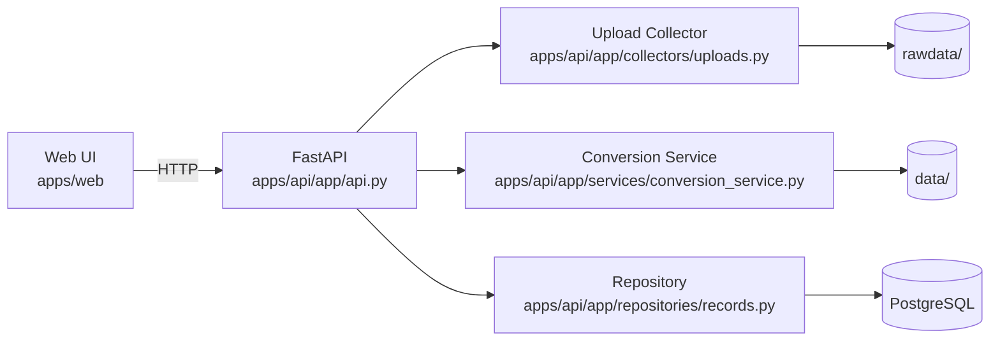
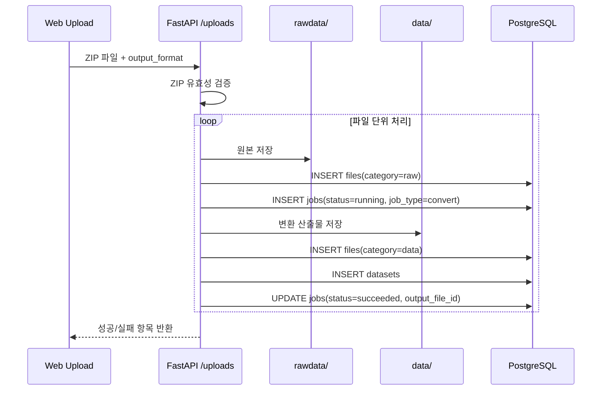

# Upload/삭제 동작 아키텍처

이 문서는 현재 구현 기준에서 Upload/삭제 버튼 클릭 시 DB와 파일시스템에서 어떤 일이 발생하는지 정리합니다.

## 1) 전체 구조



## 2) 핵심 DB 테이블

- `files`
  - 업로드 원본(`category=raw`)과 변환 결과(`category=data`) 메타 저장
- `jobs`
  - 변환/WFS 수집 실행 상태 저장
  - `input_file_id`(원본), `output_file_id`(결과) 연결
- `datasets`
  - 지도/미리보기용 메타(`feature_count`, `bbox`, `schema`) 저장

## 3) Upload 버튼 클릭 시 동작

### 3.1 ZIP 업로드 (`POST /uploads`)



- 실패 시(파일 단위):
  - raw/data 파일 정리
  - 연관 DB 레코드 정리
  - 결과적으로 "성공하면 둘 다 저장, 실패하면 둘 다 미저장" 원칙 유지

### 3.2 CSV/XLSX 업로드

- `POST /uploads/tabular/inspect`
  - 컬럼/샘플 분석만 수행 (DB 변경 없음)
- `POST /uploads/tabular/submit`
  - raw 저장 + 변환 + dataset 생성을 한 번에 처리

## 4) 삭제 버튼 클릭 시 동작

삭제는 공통 함수 `apps/api/app/api.py::_delete_file(file_id)`로 처리합니다.

```mermaid
flowchart TD
  A[삭제 버튼 클릭] --> B[DELETE /uploads/{id}<br/>or /conversions/{id}<br/>or /wfs/collections/{id}]
  B --> C{file category}
  C -->|raw| D[원본 경로 수집]
  D --> E[jobs 기반 output_file_id 수집]
  E --> G[raw/data 실제 파일 삭제]
  G --> H[DB files/jobs/datasets 정리 삭제]
  C -->|data| I[data 경로 수집]
  I --> G
```

### raw 삭제 시

1. raw 경로를 삭제 대상에 추가  
2. `jobs.input_file_id == raw_id`인 변환 결과 data를 삭제 대상에 추가  
3. 파일 삭제 후 `files/jobs/datasets` 연관 레코드 정리

### data 삭제 시

1. data 파일 경로 삭제  
2. 해당 data를 참조하는 `jobs/datasets` 정리  

## 5) 정합성 원칙

- 업로드/변환 실패 시 raw/data 미스매치가 남지 않도록 정리
- 삭제 시 raw-data 간 job 연관을 따라가며 동시 정리

## 6) 관련 코드 위치

- API 엔드포인트: `apps/api/app/api.py`
  - 업로드: `POST /uploads`, `POST /uploads/tabular/*`
  - 삭제: `DELETE /uploads/{file_id}`, `DELETE /conversions/{file_id}`, `DELETE /wfs/collections/{file_id}`
  - 내부 삭제 로직: `_delete_file()`
- 업로드 저장: `apps/api/app/collectors/uploads.py`
- 변환 처리: `apps/api/app/services/conversion_service.py`
- DB CRUD: `apps/api/app/repositories/records.py`
- 세션/트랜잭션: `apps/api/app/db.py`
